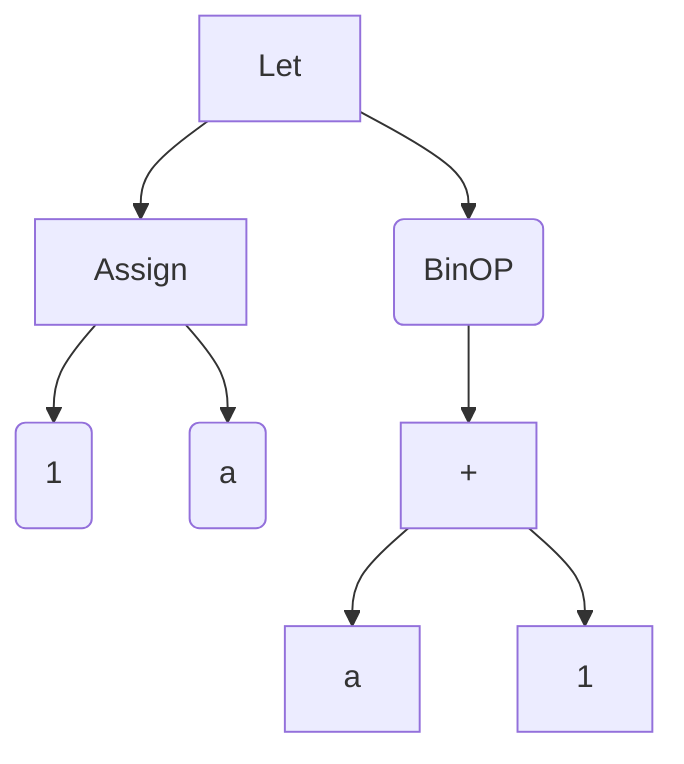

# 27 Feb

## Chirag Sarda(@chirag-25)
## Dheeraj Yadav(@dheera-01)

### Work done:
- Integrated the `Environment` with the already implemented parser and eval.
- Modified `Environment` for handling mutability of the Identifiers.
- Introduced new keyword `const` for immutable variables. Wrote the parser for immutable variables.

#### Description
The final modified class of `Environment` is as follows:
```python
@dataclass
class Enviroment:
    envs : List[dict]

    def __init__(self):
        self.envs=[{}]

    def enter_scope(self):
        self.envs.append({})

    def exit_scope(self):
        assert self.envs
        self.envs.pop()

    def add(self, identifier, value):
        curr_env = self.envs[-1]
        if identifier.name in curr_env:
            raise InvalidProgram(f"Variable {identifier.name} already defined")
            return
        self.envs[-1][identifier.name] = [value, identifier]

    def update(self, identifier, value):
        for env in reversed(self.envs):
            if identifier.name in env:
                if env[identifier.name][-1].is_mutable:
                    env[identifier.name] = [value, identifier]
                else:
                    raise InvalidProgram(f"Variable {identifier.name} is immutable")
                return
        raise KeyError()

    def get(self, name):
        for env in reversed(self.envs):
            if name in env:
                return env[name][0]
        raise KeyError()
```
Here the a list of dictionaries is being stored where dictionary contains the mapping of `name` and list of `value` and `Identifier`. Facing difficulty in directly mapping the `Identifier` to the `value`, therefore, stored as list.
This environment is being initialised in the `__main__` of parser and then passed to the eval so that same `Environment` instance can be used for the complete sequence. Following the initilisation:
```python
if __name__ == '__main__':

    file = open("tests_parser/const.txt", "r")

    program = file.read()
    obj_parser = Parser.from_lexer(
        Lexer.from_stream(Stream.from_string(program)))

    a = obj_parser.parse_program()
    print(a)
    program_env = Enviroment()
    print(program_env)
    ans = eval(a, program_env)
    for i in ans:
        print(i)
```

For handling the mutable and immutable variables, introduced a new member `is_mutable` in the `Identifier` class for storing the mutability of a variable. By default, all the variables are stored as mutable(`is_mutable: bool = True`).

For handling the updation of the mutable or immutable variables, extra condition were introduced in the `update` method of Environment as follows:

```python
if env[identifier.name][-1].is_mutable:
    env[identifier.name] = [value, identifier]
else:
    raise InvalidProgram(f"Variable {identifier.name} is immutable")
```

For integrating the mutablility with already implemented, a new keyword `const` is introduced and parser for works as follows:
```python
case Keyword("const"):
        return self.parse_const()
```

```python
def parse_const(self):
        self.lexer.advance()
        self.lexer.match(Keyword("assign"))
        identifier = self.parse_atom()
        identifier.is_mutable = False
        self.lexer.match(Operator("="))
        right_part = self.parse_expr()
        return Assign(identifier, right_part)
```
Here it defers from the `assign` as `parse_const` manually sets the `is_mutable = False` and then stores the Identifier.

## Rahul Rai(@RahulRai02)

### Work Done
- Implemented declaration of lists. 
- Wrote the parser of list and made some changes in print as well. 
- Test cases in parse_list.txt.

#### List Declarations
For the list, I have thought of 2 ways:- We can implement it using a list and the 2nd one using a dictionary. In the dictionary part, the key will be the index and the value will be the value of that particular element.
I finally proceeded with the list implementation. I am making a list class, where the name will be of the type Identifier and the value will be of the type list which will store the ASTs.
Here is the code for the declaration of class declared in declarations.py

```python
@dataclass
class ListLiteral:
   name: Identifier
   value: list['AST']
  
   def __repr__(self) -> str:
       return f"List({self.name}, {self.value})"
```

How can we declare a list now?
The list can be declared using the below syntax:
```python
list arr = [7, 2, 3, 4];
print(arr)

list arr1 = ["hello", 1, 11, 24, "hi"];
print(arr1);
```
Here an explicit keyword list is declared for defining a list, followed by an Identifier which is the name of the list and then the enclosing the elements in a opening and closing brackets like `[1, 2, 3]`.
	
Details on how the the list is parsed:
```python
   def parse_list(self):
       """parse list


       Returns:
           list AST: return AST of list
       """
       self.lexer.match(Keyword("list"))
       left_part = self.parse_atom()
       self.lexer.match(Operator("="))
      
       self.lexer.match(Bracket("["))
       l = []
       while True:
           match self.lexer.peek_current_token():
               case Bracket("]"):
                   self.lexer.advance()
                   break
               case Operator(","):
                   self.lexer.advance()
               case _:
                   # list.append(self.lexer.peek_current_token())
                   l.append(self.parse_atom())
       # print(l)
       return ListLiteral(left_part, l)
```

-   Match the keyword list.
-   After matching the keyword list, you will be pointing to the identifier name. Parse the identifier using parse_atom().
-   Match the operator “=”.
-   Now the main part comes, here I am iterating till we encounter a closing bracket that is “]”.
    -   If it's a closing bracket, then break out of the infinite while loop.
    -   Check for Operator (“,”), if it's there advance to the next token that is indirectly moving the pointer to the next token.
    -   The last case is where I am appending the literals whether they are StringLiteral, NumLiteral etc.. and returning them to the ListLiteral class with the parsed identifier name and the list of literals.


## Sandeep Desai(@Sandeep-Desai)

### Work Done:
-   Test cases for let statements, integrated environment with let statements (lexical scoping).

#### Let Statements
Let statments consists of two components first being the assignment operator and second being the expression we want to evaluate. 
For instance consider the following let statement which we want to execute: 

```
let a=1 in a+1 
```

The following should be the AST generated for this statement 


**Note**: Parser for let statements is not yet completed hence we cannot write programs involving let statements as text files. 

We have tested Let statements on following test cases:

```
let a=1 in a+3
```

Output :
``
4
``


```
let a=1 in a+a 
```
	
Output:
``
2
``

```
let x=2 in let y=3 in x+y
```

Output:
``
5
``

Also we have implemented lexical scoping (integrated enviroment with let statements)

Thus following program also works correctly:

``
let a=1 in let b=a in let a=a+1 in a+b 
``

Output :
``
3
``


## Sankskriti Sarkar(@Sanskriti-56)
