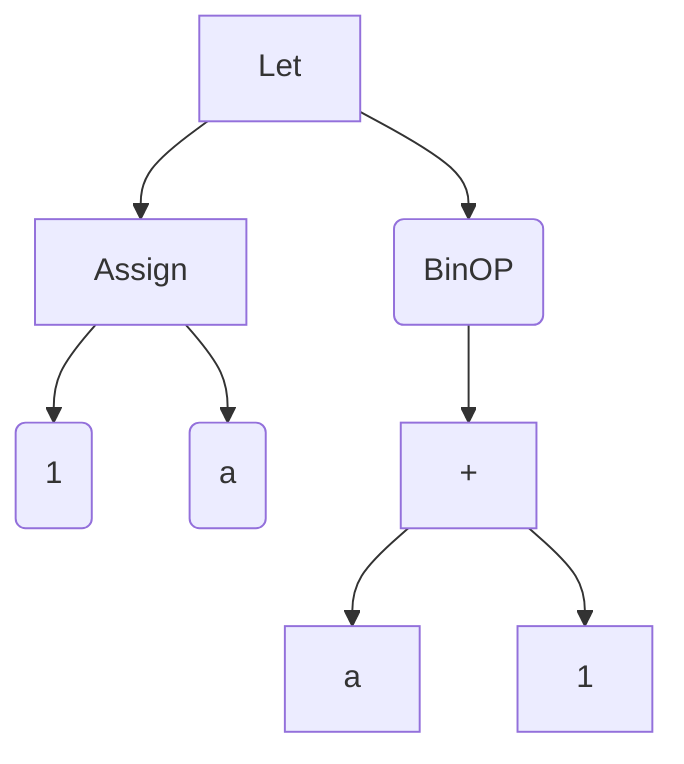

# 27 Feb

## Chirag Sarda(@chirag-25)

### Work Done:
-   I introduced the sequence last week in the code, so in this week, i have written the eval function for the sequence and then ran the while and for with the added sequence. 
-   Started making the documentation for the compiler. Made the documentation for Lexer. It will allow my other team mates to understand the code better. Here is the link of lexer documentation. https://docs.google.com/document/d/1z4aL49CI5Z9QV66SvI2PCIF_E2Tk3LYo6vdehSJQZcc/edit?usp=sharing 

#### Eval for sequence
This is written in eval function of sim.py file:
Right now, our language is expression oriented, i.e. every line has some value. I considered the whole program as a nested sequence. Since whole program is a sequence then 
ans list store value of each line in the list and if there is some new scope (block) starts then instead of a single value a list is added in the the ans list.

```python
case Sequence(statements):
    ans = []
    for statement in statements:
        # print(f"statement: {statement}")
        ans.append(eval(statement, environment))
    # print(f"ans: {ans}")
    return ans
```

Example:
```
assign a = 5;
5 + 5.5;
if(a>4)
{
    5+6;
    7+9;
}
else
{
    8 + 9 + 6;
    4 + 9;
};
```
When we pass this, ans list will look like:
```python
ans: [None, 10.5, [11, 16]]
```

#### Eval for while

```python
case While(cond, body):
    c = eval(cond, environment)
    body_iteration_lst = []
    while (c == True):
        body_iteration_lst.append(eval(body, environment))
        c = eval(cond, environment)
    return body_iteration_lst
```

he While function is a loop construct that takes two arguments:

- cond: loop condition expression that evaluates to a Boolean value. The loop will continue to execute as long as this expression is true. 
- body: loop body that contains the statements to be executed on each iteration.

#####   Implementation
The While function implements a basic loop construct that executes the statements in the body argument repeatedly as long as the loop condition cond evaluates to true. The cond and body arguments are evaluated in the given environment. On each iteration of the loop, the body statements are executed, and the result of each iteration is appended to a list called body_iteration_lst. The c variable is re-evaluated after each iteration to determine if the loop should continue executing.

Code breakdown
Here's a step-by-step breakdown of the While loop implementation code:

- c = eval(cond, environment): Evaluate the loop condition expression cond in the given environment and assign the result to a variable c. 
- body_iteration_lst = []: Initialize an empty list to store the results of each iteration of the loop. 
- while (c == True):: Begin a while loop that executes as long as c is true. 
- body_iteration_lst.append(eval(body, environment)): Evaluate the body expression in the given environment and append the result to the body_iteration_lst list. 
- c = eval(cond, environment): Re-evaluate the loop condition expression cond in the given environment and assign the result to the variable c. 
- return body_iteration_lst: Return the body_iteration_lst list as the final result of the While loop.


**Note**: at the time of implementing these construct, i have considered only the global scoping. No other scoping was implemented. There is only one environment which store variable and its value.

Example:
```
assign i = 0;
while(i< 4)
{
    assign i = i +1;
    print(i);
    assign i = i + 1;
};
```
Output:
```
1
3
```

#### Eval for:

```python
case For(exp1, condition, exp2, body):
    eval(exp1, environment)
    cond = eval(condition, environment)
    body_iteration_lst = []
    if (cond == True):
        temp = (eval(body, environment))
        temp.append(eval(exp2, environment))
        body.statements.append(exp2)
        body_iteration_lst = (eval(While(condition, body)))
        body_iteration_lst.insert(0, temp)
    return body_iteration_lst
```

The For function is a loop construct that takes four arguments:

- exp1: initialization expression that sets the initial value of the loop variable.
condition: loop condition expression that evaluates to a Boolean value. The loop will continue to execute as long as this expression is true.
- exp2: update expression that modifies the loop variable at the end of each iteration.
body: loop body that contains the statements to be executed on each iteration.

##### Implementation
The For function is implemented using a While loop construct. The code first evaluates the initialization expression exp1 and the loop condition expression condition in the given environment (here global). It then appends the exp2 expression to the end of the body.statements list, which is a list of statements that make up the loop body. The code then evaluates a While loop construct, passing in the loop condition condition and the loop body body. The result of the While loop (i.e., the list of results from each iteration of the loop) is returned as the final result of the For loop.

##### Code breakdown
Here's a step-by-step breakdown of the For loop implementation code:

- eval(exp1, environment): Evaluate the initialization expression exp1 in the given environment. 
- cond = eval(condition, environment): Evaluate the loop condition expression condition in the given environment and assign the result to a variable cond. 
- body.statements.append(exp2): Append the exp2 expression to the end of the body.statements list, which is a list of statements that make up the loop body. 
- body_iteration_lst = (eval(While(condition, body))): Evaluate a While loop construct, passing in the loop condition condition and the loop body body. The result of the While loop (i.e., the list of results from each iteration of the loop) is assigned to body_iteration_lst. 
- return body_iteration_lst: Return the body_iteration_lst list as the final result of the For loop.

Example:
```
for(assign i = 0; i < 4; assign i = i + 1)
{
    assign i = i + 1;
    print(i);
};
```
Output:
```
1
3
```

##### TestCase factorial
```python
import os, sys
current_dir = os.getcwd()
sys.path.append(current_dir)
# print(f"syst path {sys.path}")


from my_parser import *


def test_parse_factorial():
    # print("test_parse_fact")
    text = """
    assign i = 1;
    assign fact = 1;
    while(i <5) {assign i = i + 1; assign fact = fact * i;};
    print(fact);
    """
   
    obj_parser = Parser.from_lexer(
        Lexer.from_stream(Stream.from_string(text)))
    # print(obj_parser)
    a = obj_parser.parse_program()
    # print("Program\n",a)
    lst = [
        None,
        None,
        [[None, None, 2], [None, None, 6], [None, None, 24], [None, None, 120]]]
    program_env = Environment()
    eval(a, program_env)
    # print("ans",eval(a, program_env))
    # assert eval(a,program_env ) == lst
    # print("ans",ans)
    # for i in ans:
    #     print(i)


if __name__ == "__main__":
    # test_eval()
    test_parse_factorial()
    # print("All tests passed")
```
Output:
```
120
```


## Dheeraj Yadav(@dheera-01)

### Work Done:
- Integrated the `Environment` with the already implemented parser and eval.
- Modified `Environment` for handling mutability of the Identifiers.
- Introduced new keyword `const` for immutable variables. Wrote the parser for immutable variables.
- Compiled the weekly report and formatted in markdown.

#### Description
The final modified class of `Environment` is as follows:
```python
@dataclass
class Enviroment:
    envs : List[dict]

    def __init__(self):
        self.envs=[{}]

    def enter_scope(self):
        self.envs.append({})

    def exit_scope(self):
        assert self.envs
        self.envs.pop()

    def add(self, identifier, value):
        curr_env = self.envs[-1]
        if identifier.name in curr_env:
            raise InvalidProgram(f"Variable {identifier.name} already defined")
            return
        self.envs[-1][identifier.name] = [value, identifier]

    def update(self, identifier, value):
        for env in reversed(self.envs):
            if identifier.name in env:
                if env[identifier.name][-1].is_mutable:
                    env[identifier.name] = [value, identifier]
                else:
                    raise InvalidProgram(f"Variable {identifier.name} is immutable")
                return
        raise KeyError()

    def get(self, name):
        for env in reversed(self.envs):
            if name in env:
                return env[name][0]
        raise KeyError()
```
Here the a list of dictionaries is being stored where dictionary contains the mapping of `name` and list of `value` and `Identifier`. Facing difficulty in directly mapping the `Identifier` to the `value`, therefore, stored as list.
This environment is being initialised in the `__main__` of parser and then passed to the eval so that same `Environment` instance can be used for the complete sequence. Following the initilisation:
```python
if __name__ == '__main__':

    file = open("tests_parser/const.txt", "r")

    program = file.read()
    obj_parser = Parser.from_lexer(
        Lexer.from_stream(Stream.from_string(program)))

    a = obj_parser.parse_program()
    print(a)
    program_env = Enviroment()
    print(program_env)
    ans = eval(a, program_env)
    for i in ans:
        print(i)
```

For handling the mutable and immutable variables, introduced a new member `is_mutable` in the `Identifier` class for storing the mutability of a variable. By default, all the variables are stored as mutable(`is_mutable: bool = True`).

For handling the updation of the mutable or immutable variables, extra condition were introduced in the `update` method of Environment as follows:

```python
if env[identifier.name][-1].is_mutable:
    env[identifier.name] = [value, identifier]
else:
    raise InvalidProgram(f"Variable {identifier.name} is immutable")
```

For integrating the mutablility with already implemented, a new keyword `const` is introduced and parser for works as follows:
```python
case Keyword("const"):
        return self.parse_const()
```

```python
def parse_const(self):
        self.lexer.advance()
        self.lexer.match(Keyword("assign"))
        identifier = self.parse_atom()
        identifier.is_mutable = False
        self.lexer.match(Operator("="))
        right_part = self.parse_expr()
        return Assign(identifier, right_part)
```
Here it defers from the `assign` as `parse_const` manually sets the `is_mutable = False` and then stores the Identifier.

## Rahul Rai(@RahulRai02)

### Work Done
- Implemented declaration of lists. 
- Wrote the parser of list and made some changes in print as well. 
- Test cases in parse_list.txt.

#### List Declarations
For the list, I have thought of 2 ways:- We can implement it using a list and the 2nd one using a dictionary. In the dictionary part, the key will be the index and the value will be the value of that particular element.
I finally proceeded with the list implementation. I am making a list class, where the name will be of the type Identifier and the value will be of the type list which will store the ASTs.
Here is the code for the declaration of class declared in declarations.py

```python
@dataclass
class ListLiteral:
   name: Identifier
   value: list['AST']
  
   def __repr__(self) -> str:
       return f"List({self.name}, {self.value})"
```

How can we declare a list now?
The list can be declared using the below syntax:
```python
list arr = [7, 2, 3, 4];
print(arr)

list arr1 = ["hello", 1, 11, 24, "hi"];
print(arr1);
```
Here an explicit keyword list is declared for defining a list, followed by an Identifier which is the name of the list and then the enclosing the elements in a opening and closing brackets like `[1, 2, 3]`.
	
Details on how the the list is parsed:
```python
   def parse_list(self):
       """parse list


       Returns:
           list AST: return AST of list
       """
       self.lexer.match(Keyword("list"))
       left_part = self.parse_atom()
       self.lexer.match(Operator("="))
      
       self.lexer.match(Bracket("["))
       l = []
       while True:
           match self.lexer.peek_current_token():
               case Bracket("]"):
                   self.lexer.advance()
                   break
               case Operator(","):
                   self.lexer.advance()
               case _:
                   # list.append(self.lexer.peek_current_token())
                   l.append(self.parse_atom())
       # print(l)
       return ListLiteral(left_part, l)
```

-   Match the keyword list.
-   After matching the keyword list, you will be pointing to the identifier name. Parse the identifier using parse_atom().
-   Match the operator “=”.
-   Now the main part comes, here I am iterating till we encounter a closing bracket that is “]”.
    -   If it's a closing bracket, then break out of the infinite while loop.
    -   Check for Operator (“,”), if it's there advance to the next token that is indirectly moving the pointer to the next token.
    -   The last case is where I am appending the literals whether they are StringLiteral, NumLiteral etc.. and returning them to the ListLiteral class with the parsed identifier name and the list of literals.


## Sandeep Desai(@Sandeep-Desai)

### Work Done:
-   Test cases for let statements, integrated environment with let statements (lexical scoping).

#### Let Statements
Let statments consists of two components first being the assignment operator and second being the expression we want to evaluate. 
For instance consider the following let statement which we want to execute: 

```
let a=1 in a+1 
```

The following should be the AST generated for this statement 


**Note**: Parser for let statements is not yet completed hence we cannot write programs involving let statements as text files. 

We have tested Let statements on following test cases:

```
let a=1 in a+3
```

Output :
``
4
``


```
let a=1 in a+a 
```
	
Output:
``
2
``

```
let x=2 in let y=3 in x+y
```

Output:
``
5
``

Also we have implemented lexical scoping (integrated enviroment with let statements)

Thus following program also works correctly:

``
let a=1 in let b=a in let a=a+1 in a+b 
``

Output :
``
3
``


## Sankskriti Sarkar(@Sanskriti-56)
