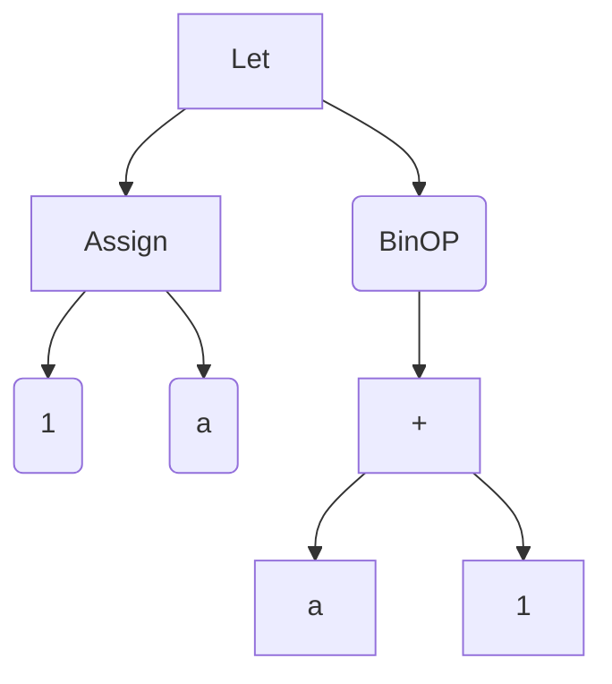

## Let Statements
Let statments consists of two components first being the assignment operator and second being the expression we want to evaluate. 
For instance consider the following let statement which we want to execute: 

``
let a=1 in a+1 
``

The following should be the AST generated for this statement 

**Note**: Parser for let statements is not yet completed hence we cannot write programs involving let statements as text files. 

We have tested Let statements on following test cases:

``
let a=1 in a+3
``

Output :
``
4
``

``
	let a=1 in a+a 
``
	
Output:
``
2
``

``
let x=2 in let y=3 in x+y
``

Output:
``
5
``

Also we have implemented lexical scoping (integrated enviroment with let statements)

Thus following program also works correctly:

``
let a=1 in let b=a in let a=a+1 in a+b 
``

Output :
``
3
``

